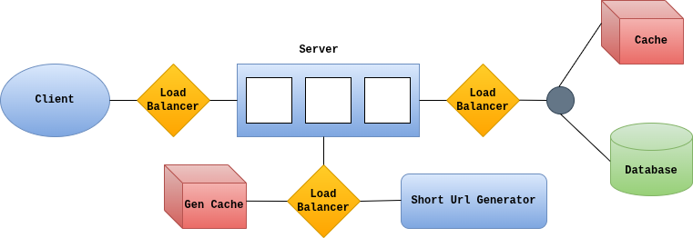

# URL Shortener Backend

This project is a robust, production-ready URL shortening backend designed for scalability, security, and real-time analytics. Built with Go, PostgreSQL, Redis, and Consul, it provides a modern API for creating, managing, and tracking short links with advanced features such as OAuth2 authentication, cache-aside performance, and asynchronous analytics.

---

## 🏗️ System Architecture



The architecture leverages a layered design:
- **API Server**: Handles HTTP requests, authentication, and routing.
- **Service Layer**: Encapsulates business logic for URLs, users, and stats.
- **Storage Layer**: Uses PostgreSQL for normalized data and Redis for fast caching.
- **Consul**: Manages dynamic configuration and service discovery.

## 🗄️ Database Schema


The schema is fully normalized for data integrity and analytics, with tables for users, URLs, clicks, and statistics.

## 🚀 Features
**RESTful API**: Endpoints for creating, resolving, and managing short URLs.
**High Performance**: O(1) redirection using Redis cache-aside strategy.
**Asynchronous Analytics**: Real-time click tracking with Go worker pools.
**Secure Auth**: OAuth2-based user registration and token management.
**Config Management**: Dynamic configuration with Consul and Viper.
**Scalable Design**: Easily extendable for new features and deployments.
**Production Ready**: Includes migration scripts, health checks, and monitoring hooks.

## 🛠️ Prerequisites
- Docker (for PostgreSQL, Redis, and Consul)
- Go 1.26+

## ⚙️ Initial Setup

### 1. Infrastructure
```bash
docker start pg-container redis-stack consul
```

### 2. Configuration Seeding
```bash
bash scripts/seed_consul.sh
```

### 3. Database Migrations
You can run migrations using the built-in Go CLI or via a bash command for manual schema management.

**Using Go CLI (Recommended):**
```bash
export CONSUL_URL=localhost:8500
export CONSUL_PATH=config/backend
go run main.go migrate
```

**Using Bash (Manual Rollback/Setup):**
```bash
# To drop all normalized tables
docker exec -i pg-container psql -U postgres -d url_shortener -c "DROP TABLE IF EXISTS url_stats, clicks, short_urls, long_urls, users CASCADE;"
```

## 🏃 Running the Application
```bash
./run.sh
```

---

## 📚 Documentation
- **[API Guide](Backend/api.md)**: API endpoints and usage.
- **[Performance Guide](Backend/performance.md)**: How to track latency and worker pool health.
- **[Testing Guide](Backend/testing.md)**: Test instructions and coverage.
